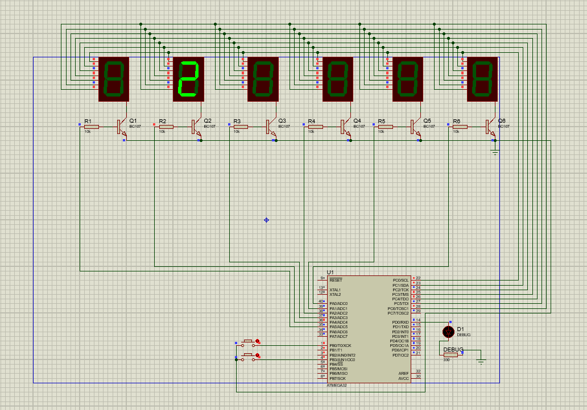

# 6-Digit Counter with 7-Segment Displays (ATmega32)

## Description
This program uses an ATmega32 microcontroller to drive six 7-segment displays, simulating a 6-digit counter. The counter value can be incremented or decremented using two buttons. The digits are displayed sequentially across the 7-segment displays, with each press of a button updating the value shown.

## Screenshot

## Features:
- Six 7-segment displays showing a 6-digit number.
- Increment and decrement buttons to modify the displayed number.
- Wraps around from `999999` to `000000` and vice versa.

## Hardware Requirements
- **Microcontroller**: ATmega32
- **Seven-Segment Displays**: 6 (for displaying 6 digits)
- **Buttons**: Two buttons connected to PORTB pins to increment and decrement the number.
  - Button 1: Increment (connected to PINB.0)
  - Button 2: Decrement (connected to PINB.3)

## Pin Mapping
- **PORTA**: Controls the 6 digits on the 7-segment displays.
- **PORTB**: 
  - Pin 0: Button 1 (Increment)
  - Pin 3: Button 2 (Decrement)
- **PORTC**: Displays the digits on the 7-segment displays.
- **PORTD**: Used for debugging output.

## Software Requirements
- **Compiler**: CodeWizardAVR V3.14 (Advanced)
- **Language**: C

## Program Logic
1. The 7-segment displays show a 6-digit number (initially `000000`).
2. Button 1 increments the displayed number by 1.
3. Button 2 decrements the displayed number by 1.
4. The number wraps around from `999999` to `000000` and vice versa.

## How to Use
1. Connect the hardware as per the pin mapping section.
2. Compile and upload the code to the ATmega32 microcontroller.
3. Press Button 1 to increment the displayed number.
4. Press Button 2 to decrement the displayed number.

## Author

- Created by [Mohammd H. Moazzen](https://github.com/TirdadMH) 
- Date: June 13, 2023
